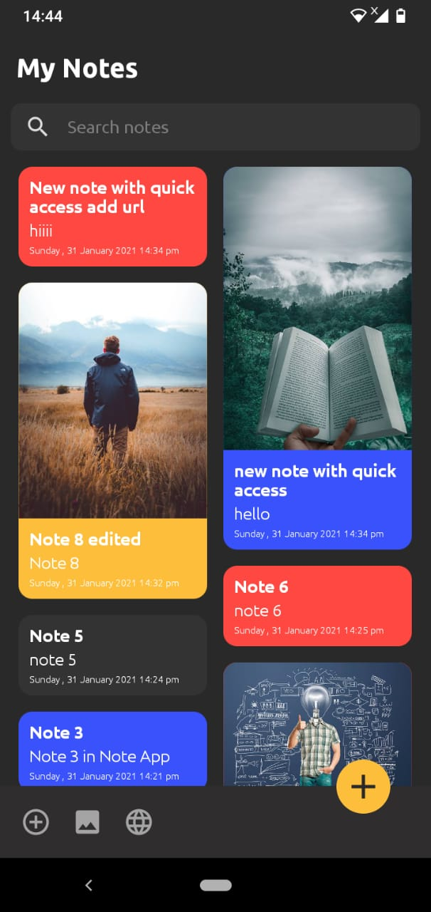
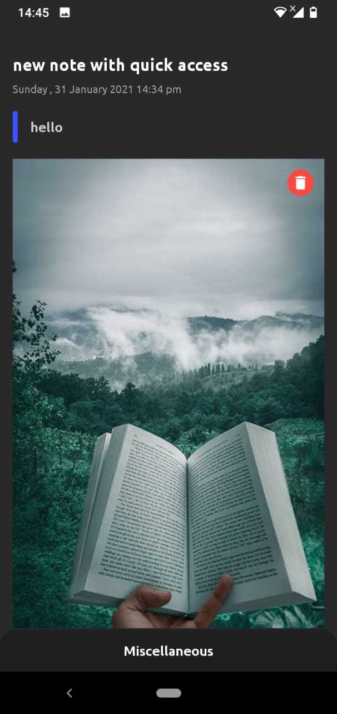
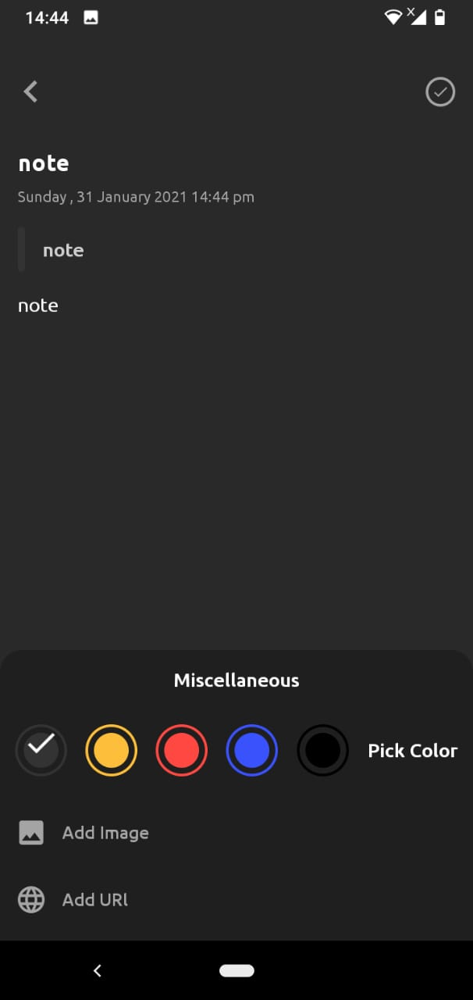
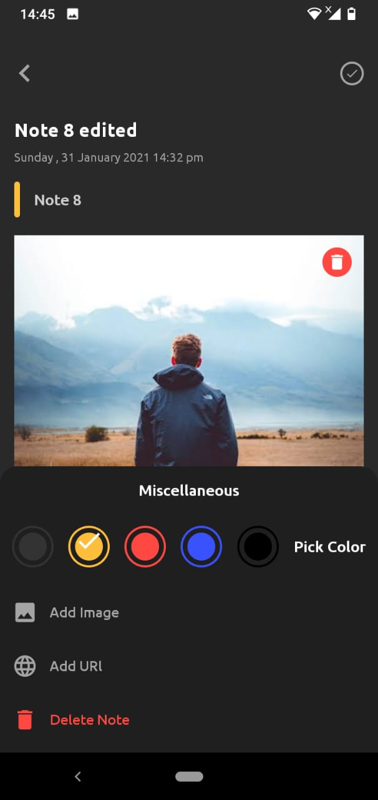
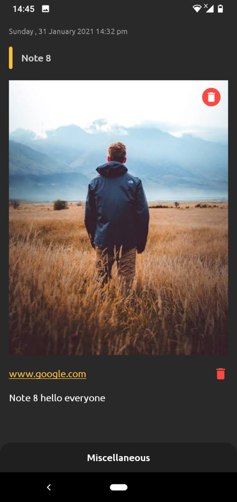

# NoteApp
Simple Note App with Room Database

# Tools

- ConstraintLayout
- LinearLayout
- RecyclerView
- RoomDatabase

# Images
     
   

# Author

Created by Mohamed Sobhy on 2021. Copyright © 2021 Mohamed Sobhy. [LinkedIn](https://www.linkedin.com/in/mohamed-sobhy-040958181/)

# Environment

This project was generated by Android Studio 4.1.1 and Java 

# Further Help

To get more help on the project, you can contact with me by email address m7md.sob7y20@gmail.com

# Note

This project created on 2021, some libraries or code might be depreciated.

